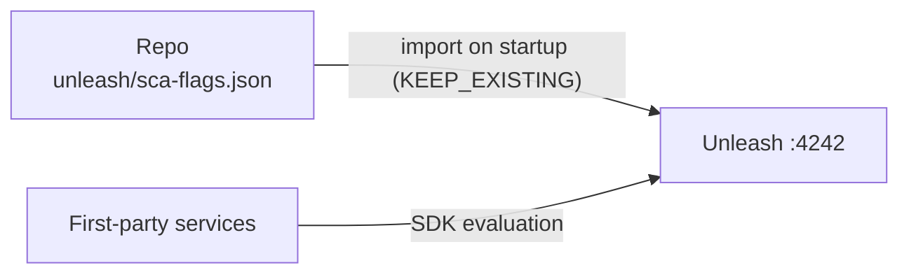

# Unleash — Architecture

> Feature flag management: flags live as code, imported on startup; services evaluate them via SDKs against the local server. Decisions stay in the app, toggles change without deploys.

## Overview

Two containers on a private bridge network ([compose.yml](../compose.yml)):
`unleashorg/unleash-server:6.4.1` and its own `postgres:16-alpine`. Only the
server publishes a port — `127.0.0.1:4242` (UI + admin + frontend APIs),
loopback only. State persists in the `unleash-pg-data` volume.

## Flags-as-code pipeline

- [`unleash/sca-flags.json`](../unleash/sca-flags.json) is the seed (export
  format v4): repo-defined flags converge on every start while runtime-created
  ones survive (`UNLEASH_IMPORT_KEEP_EXISTING=true`).
- Durable definitions belong in the file; UI edits are experimentation.
  Production imports run from the same shape declared in
  [infra-kubernetes](https://github.com/sca-templates/infra-kubernetes).
- The seeded `sca-demo-flag` proves the pipeline end-to-end and is what
  `make validate` asserts.

## Components

| Container | Image | Host port | Purpose |
| --- | --- | --- | --- |
| unleash | `unleashorg/unleash-server:6.4.1` | 4242 → 4242 (loopback) | Flag evaluation APIs + admin UI |
| unleash-postgres | `postgres:16-alpine` | internal only | Flag state |

## Configuration and secrets

- `.env` is generated by `scripts/gen-env.sh` from Vault `secret/unleash/dev`
  (`UNLEASH_ADMIN_PASSWORD`, `UNLEASH_DB_PASSWORD`) via the `unleash` AppRole;
  role_id/secret_id sit in `.secrets/`, gitignored. `.env` is `chmod 600`.
- Rotating requires recreating the volume (`FORCE=1 make vault-secrets &&
  make clean && make all`) — the old DB password is baked into Postgres data.
- Client API tokens for SDK consumers are created in the UI per project once
  real services integrate.

## Consumption model

Services read toggles through the Unleash frontend API / SDKs with
stickiness on user id — consistent rollout behavior across restarts. Flag
evaluation failures degrade to defaults in the SDKs, never to outages.

## Related

- [README.md](../README.md) — commands, stack lifecycle and troubleshooting.
- Vault note: [04-infrastructure/unleash.md (sca-docs)](https://github.com/sca-templates/sca-docs/blob/main/04-infrastructure/unleash.md).
